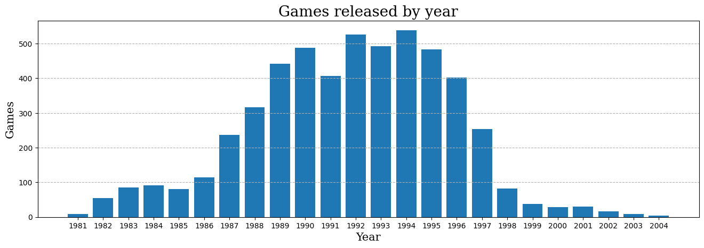
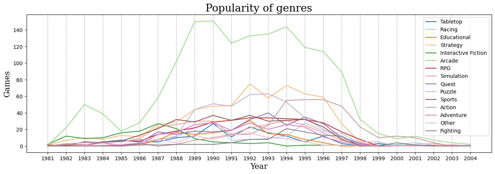

# Python Practice 3
This folder contains my codes for practice 3 tasks of subject *Python programming*.
The full practice document can be found [here][kp-rep].

Table of Contents:
- [Python Practice 3](#python-practice-3)
  - [Task 1 (PEP-8 rules)](#task-1-pep-8-rules)
  - [Task 6 (error logging)](#task-6-error-logging)
  - [Task 7 (sprite generation)](#task-7-sprite-generation)
  - [Task 8 (galaxy generation)](#task-8-galaxy-generation)
  - [Task 11 (games database)](#task-11-games-database)

---
## Task 1 (PEP-8 rules)
> Write code examples that correspond to given PEP-8 violations.

Here's a table of examples for each violation:

| PEP-8                                                         |      Code       |
| ------------------------------------------------------------- | :-------------: |
| whitespace before '('                                         |    `foo ()`     |
| missing whitespace around operator                            |      `1>2`      |
| missing whitespace after ','                                  |     `[1,2]`     |
| unexpected spaces around keyword / parameter equals           | `foo(par = 5)`  |
| multiple statements on one line (colon)                       | `if True: pass` |
| multiple statements on one line (semicolon)                   | `foo(); bar()`  |
| comparison to None should be 'if cond is None:'               | `if a == None:` |
| comparison to True should be 'if cond is True:' or 'if cond:' | `if a == True:` |

There's also a violation I could not put into the table due to how Markdown formatting works:
`expected 2 blank lines, found 1` - I think it's an obvious one.

Here's a four-line piece of code that has one of each violation:
```python
def foo (a =(1==True)):
    if a == None: bar(); return a,5

def bar(): pass
```

---
## Task 6 (error logging)
> Write a `run_with_log(func)` function that adds exception info to a log-file.
The function is not supposed to handle exceptions. User function is passed as parameter.

Logging exceptions is usually easy - if you can handle them. In this task however, we cannot do that.
This actually gave me hours of fruitless head scratching, until I got a hint.
That hint is to reassign the `sys.excepthook` object with your own.

To form an error message, we need the date and time, exception type, value and traceback.
The most problematic of these is the traceback. If you try to just print the traceback parameter,
you'll get something like: `<traceback object at 0x00000262C01CE780>`. To "unpack" it, we'll need
the `traceback` module. Here's the definition:
```python
def my_excepthook(exctype, value, traceback):
    date = f'{datetime.now():%H:%M:%S %d-%m-%Y}'
    tb = 'Traceback (most recent call last):\n' + \
         ''.join(format_tb(traceback))
    with open('foo.log', 'a') as log:
        log.write(f'{date}\n{tb}{exctype.__name__}: {value}\n\n')
```
Now all we need to do is assign it and call the function:
```python
def run_with_log(func, *args):
    def my_excepthook(exctype, value, traceback):
        ... # written in code block above

    sys.excepthook = my_excepthook
    func(*args)
```
And here's an example of what we got in the log file:
```
14:04:05 19-03-2022
Traceback (most recent call last):
  File "F:\coding-kispython\practice3\pr3-task06.py", line 36, in <module>
    run_with_log(error_maker, x)
  File "F:\coding-kispython\practice3\pr3-task06.py", line 31, in run_with_log
    func(*args)
  File "F:\coding-kispython\practice3\pr3-task06.py", line 18, in error_maker
    return '2' + 2
TypeError: can only concatenate str (not "int") to str
```

## Task 7 (sprite generation)
> Implement procedural generation of 5x5 pixel sprites with Matplotlib and the `imshow()` function.
Take advantage of symmetry.

To make the sprite horizontally symmetrical, we can make a 3x5 matrix and mirror it.
Since the matrix is stored as a list of lists, we need to append all but the last element
in reverse order to each sublist (row). Down below is the function that does that.
The `pixel()` function here returns a generated value for the element (pixel).
```python
def make_mx():
    mx = [[pixel() for _ in range(3)] for _ in range(5)]
    for i in mx:
        i += i[-2::-1]
    return mx
```

The more difficult part of generating colored sprites is that the color only depends on
the value and the colormap, so you can't just selectively render pixels in shapes.
What you can do though is change the colormap, albeit not that easily.
The function down below adds a bit of white to the bottom of the colormap.
It does so with some typecasting back and forth, there's no easier way that I'm aware of.
```python
def add_white(colormap):
    white = plt.cm.binary(0)                  # doesn't conflict with vstack
    colormap = colormap(linspace(0, 1, 255))  # 255 because 1 is taken by white
    colormap = vstack((white, colormap))      # stack both together

    # cast to MPL colormap type
    return colors.LinearSegmentedColormap.from_list('my_colormap', colormap)
```

The rest of the code is pretty straight forward. You can find it [here][t07].
Here's a couple examples of generated sprites:


## Task 8 (galaxy generation)
> Picture the legendary first galaxy from the game Elite (1984) with Matplotlib.

Elite has 8 galaxies with 256 planets each, and it ran on systems with just 32 KB of RAM!
That amount is not capable of storing the data for all the planets, let alone the rest of the game.
To get around that, the game procedurally generates each galaxy every time it is entered.
The entire universe is defined by the seed consisting of three numbers: 23114, 584, 46931.
You can find a detailed explanation of the algorithm [here][elite-info].

The algorithms in the original game were in C, and we're trying to replicate the generation in Python.
Luckily though, we only need to generate one galaxy, and all we need is coordinates and names.
The original function to tweak the seed used `uint16` numbers and relied on integer overflow,
which is not a thing in Python. We can, however, replicate it with `%` (modulus),
dividing by the `uint16` limit. Here's the function and the seed itself:
```python
seed = [0x5A4A, 0x0248, 0xB753] # 23114, 584, 46931

def tweakseed():
    temp = sum(seed) % 0x10000  # imitate uint16 overflow
    seed[0] = seed[1]
    seed[1] = seed[2]
    seed[2] = temp
```

The rest of the generation is pretty easy and is just some math and bitwise operations.
The coordinates are calculated by shifting the seed 8 bits to the right, limiting it to 255.
The name is selected by four pairs of characters, each pair defined by calculated index after
tweaking the seed. All we need after that is to plot the entire thing with `scatter()`.
Some tinkering with plot properties (colors, size, annotation) and the job's done.
You can find the code [here][t08]. Here's the generated image of the galaxy:


## Task 11 (games database)
> Analyze the [database][games-db] of old computer games.
> With plots, answer these questions:
> 1. What years were the most popular in terms of game releases?
> 2. What genres were popular at different periods of time?

Before we can plot the data, we need to parse it. I form a data dictionary for both of the questions:
- Games per year: `{year: number}`
- Games per year per genre: `{genre: {year: number}}`

Here's the parse function:
```python
def parse_data():
    # ... initialisation (dictionaries: years = {...}, genres = {}) 
    with open('games.csv', encoding='utf8') as file:
        for line in file:
            data = [x.strip('\"') for x in line.replace('\n', '').split(';')]
            name, genre, link, year = data
            # ... increment years[year] with checks
            # ... if first entry of genre, initialise genres[genre] = {...}
            # ... else increment genres[genre][year] with checks
    return years, genres
```

All that's left is to plot the data with `bar()` and `plot()`.
Also, for the second plot we need to use a color cycle that has at least 15 colors
(as there are 15 genres on our plot). We can use the `tab20` colormap for that.
```python
# first plot
plt.bar(years.keys(), years.values())

# color cycle for secont plot
colors = plt.cycler("color", plt.cm.tab20.colors)
plt.rcParams["axes.prop_cycle"] = colors

# second plot
for genre in genres:
    plt.plot(genres[genre].keys(), genres[genre].values(), label=genre)
```

So, down below are the plots that we got. Let's give our answers:
1. The number of releases started growing in 1987, held high in 1989-1996, peaked in 1994,
and started to decline in 1997.
2. The absolute most popular genre was Arcade. Puzzle games were popular in 1989-1994.
Strategy games were popular in 1989-1997. Action games have been popular since 1994.
RPG, Quest and Sports genres also stayed mildly popular throughout 1986-1998.




[t06]: pr3-task06.py
[t07]: pr3-task07.py
[t08]: pr3-task08.py
[games-db]: games.csv

[kp-rep]: https://github.com/true-grue/kispython
[elite-info]: http://blog.rabidgremlin.com/2015/01/14/procedural-content-generation-creating-a-universe/
